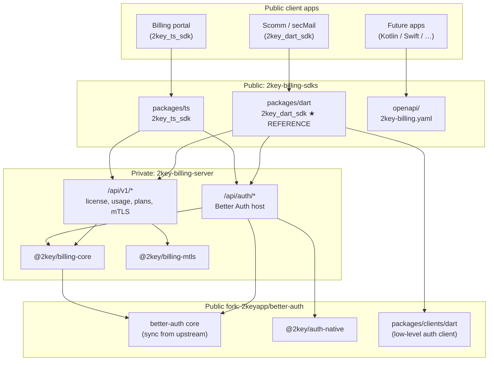

# 2key Billing — Multi-SDK Architecture & Repository Plan

**Status:** Proposed  
**Reference implementation:** `billing_dart_sdk` → rename to **`2key_dart_sdk`**  
**Last updated:** 2026-08-23  

---

## 1. Purpose

This document defines how 2key Billing is structured across repositories so that:

1. **Better Auth** stays a continuously syncable upstream fork (auth engine only).
2. **2key Billing server** stays a **private** product (license, usage, mTLS M2M, entitlements, etc.).
3. **Public SDKs** exist per language, named consistently as **`2key_<lang>_sdk`**.
4. **`2key_dart_sdk`** (today: `billing_dart_sdk`) is the **reference implementation** every other SDK must match in behavior and API shape.

---

## 2. Naming conventions

### 2.1 Product vs auth engine

| Term | Meaning |
|------|---------|
| **2key Billing** | Product: APIs, license JWTs, usage metering, mTLS M2M, plans, entitlements, portal |
| **Better Auth** | Auth engine (fork). Not the product brand in SDKs or end-user docs |
| **@2key/auth-native** | Server-side Better Auth plugin for native clients (replaces `@better-auth/flutter` naming) |

### 2.2 Public SDK package names

| Language / runtime | Package name | Registry |
|--------------------|--------------|----------|
| Dart / Flutter | **`2key_dart_sdk`** | pub (or git until published) |
| TypeScript (browser + isomorphic fetch) | **`2key_ts_sdk`** / `@2key/ts-sdk` | npm |
| TypeScript React helpers (optional) | **`2key_react_sdk`** / `@2key/react-sdk` | npm |
| Kotlin (Android / JVM) | **`2key_kotlin_sdk`** | Maven |
| Swift (iOS / macOS) | **`2key_swift_sdk`** | SPM |
| Python | **`2key_python_sdk`** | PyPI |
| Node server (service / M2M helpers) | **`2key_node_sdk`** / `@2key/node-sdk` | npm |
| C# (later) | **`2key_dotnet_sdk`** | NuGet |
| Go (later) | **`2key_go_sdk`** | module |

**Rule:** Always `2key_<lang>_sdk`. Never `billing_*` or `better_auth_*` as the public product package name.

### 2.3 Private packages (never published publicly)

| Package | Role |
|---------|------|
| `@2key/billing-core` | License, usage, plans, seats, pricing, entitlement rules |
| `@2key/billing-mtls` | CA, cert issue/rotate, mTLS verify, machine identities |
| `@2key/billing-api` | HTTP app mounting `/api/v1` |
| `@2key/billing-auth-host` | Better Auth wiring + hooks into billing-core |

### 2.4 Rename map (current → target)

| Current | Target |
|---------|--------|
| `billing_dart_sdk` | **`2key_dart_sdk`** |
| `BillingAuthClient`, `BillingSession`, `BillingSdk` | Keep names initially for compatibility **or** alias under `TwoKey*` with deprecation period (decide in Phase 1) |
| `@better-auth/flutter` | `@2key/auth-native` (or keep path, change package name) |
| `packages/flutter/dart` (`better_auth`) | `packages/clients/dart` — still low-level; **not** imported by host apps |
| secMail / Scomm dep `billing_dart_sdk` | `2key_dart_sdk` |

---

## 3. Goals and non-goals

### 3.1 Goals

- Continuous sync of `2keyapp/better-auth` from upstream `better-auth/better-auth`.
- Rapid product development (usage-based billing, mTLS M2M, etc.) **without** blocking on upstream merges.
- One **behavioral contract** for all SDKs, with **`2key_dart_sdk` as reference**.
- Private IP in server-side packages; public SDKs are HTTP + local crypto (license verify) only.
- Host apps (e.g. Scomm / secMail) depend on **`2key_dart_sdk` only** — never on `better_auth` directly.

### 3.2 Non-goals

- Turning Better Auth into “2key Billing” by forking large product features into the auth repo.
- Publishing private billing-core to npm/pub.
- Building separate desktop SDKs when Flutter / `2key_dart_sdk` already covers desktop.
- Requiring every language to reimplement proprietary metering logic client-side.

---

## 4. High-level architecture

```
┌──────────────────────────────────────────────────────────────────┐
│ PUBLIC CLIENTS                                                   │
│  Scomm (2key_dart_sdk) · Portal (2key_ts_sdk) · future apps     │
└────────────────────────────┬─────────────────────────────────────┘
                             │ HTTPS
                             ▼
┌──────────────────────────────────────────────────────────────────┐
│ PRIVATE: 2key-billing-server                                     │
│  /api/v1/*  (license, usage, plans, mTLS admin, subscriptions)   │
│  /api/auth/* (Better Auth host + @2key/auth-native)              │
│  @2key/billing-core · @2key/billing-mtls                         │
└────────────────────────────┬─────────────────────────────────────┘
                             │ depends on (pinned SHA / release branch)
                             ▼
┌──────────────────────────────────────────────────────────────────┐
│ PUBLIC FORK: 2keyapp/better-auth                                 │
│  upstream sync · native plugin · Dart auth client (low-level)    │
└──────────────────────────────────────────────────────────────────┘
```



### 4.1 Dependency rules (hard)

| From → To | Allowed? |
|-----------|----------|
| Public SDK → billing-server | HTTPS only |
| Public SDK → better-auth Dart client | Yes, **inside SDK only**; not re-exported to apps |
| Public SDK → `@2key/billing-core` | **No** |
| billing-server → better-auth fork | Yes |
| better-auth fork → billing-server | **No** |
| Public SDK repo → private server source | **No** (OpenAPI export only) |

---

## 5. Repository layout

### 5.1 Recommended three-repo (+ apps)

```
2keyapp/better-auth                 # PUBLIC fork — sync heavy, change light
2keyapp/2key-billing-server         # PRIVATE — product heavy
2keyapp/2key-billing-sdks           # PUBLIC — OpenAPI + all 2key_*_sdk packages
2keyapp/billing-portal              # PRIVATE (or restricted) — uses 2key_ts_sdk
scomm-ai/secMail0                   # PRIVATE app — uses 2key_dart_sdk
```

### 5.2 `2keyapp/better-auth` (fork)

```
better-auth/
├── packages/
│   ├── better-auth/                 # upstream core — MINIMAL diffs
│   ├── native/                      # @2key/auth-native (was flutter plugin)
│   └── clients/
│       └── dart/                    # better_auth pub package (low-level)
├── .github/workflows/
│   └── upstream-sync.yml            # merge upstream, test, notify
└── docs/integrations/native-client.md
```

**Allowed in this repo:**

- Upstream merges and conflict resolution.
- Native-client auth: deep links, loopback `?cookie=`, origin headers / trusted origins, session handoff hooks that are **auth-transport** only.
- Low-level Dart (and later Kotlin/Swift) **auth** clients if kept with the fork.

**Forbidden in this repo:**

- Usage meters, invoices, pricing.
- License JWT signing / business rules.
- mTLS CA / machine billing identity product logic.
- Plan catalog, seats, entitlements engines.

### 5.3 `2keyapp/2key-billing-server` (private)

```
2key-billing-server/
├── packages/
│   ├── billing-core/                # @2key/billing-core
│   │   ├── license/                 # ES256 issue/verify server-side, ETag
│   │   ├── usage/                   # ★ usage-based billing
│   │   ├── plans/
│   │   ├── subscriptions/
│   │   └── entitlements/
│   ├── billing-mtls/                # @2key/billing-mtls ★ M2M
│   │   ├── ca/
│   │   ├── issue/
│   │   └── verify/
│   ├── billing-api/                 # HTTP /api/v1
│   └── billing-auth-host/           # betterAuth({ plugins: [native()] })
├── migrations/
├── keys/                            # NEVER in SDK repos
└── deploy/
```

### 5.4 `2keyapp/2key-billing-sdks` (public monorepo)

```
2key-billing-sdks/
├── openapi/
│   └── 2key-billing.yaml            # /api/v1 source of truth
├── docs/
│   ├── auth-protocol.md             # browser vs native auth
│   ├── sdk-conformance.md           # how to match 2key_dart_sdk
│   └── architecture.md              # this document (or link)
├── conformance/
│   ├── fixtures/                    # license JWTs, ETag cases, usage events
│   └── suites/                      # language-agnostic test vectors
├── packages/
│   ├── dart/                        # ★ REFERENCE: 2key_dart_sdk
│   ├── ts/                          # 2key_ts_sdk
│   ├── react/                       # 2key_react_sdk (optional)
│   ├── node/                        # 2key_node_sdk (optional M2M/service)
│   ├── kotlin/                      # 2key_kotlin_sdk (later)
│   ├── swift/                       # 2key_swift_sdk (later)
│   └── python/                      # 2key_python_sdk (later)
└── examples/
    ├── flutter_app/                 # mirrors Scomm patterns at small scale
    └── browser_vite/
```

**Migration:** move/rename current `billing_dart_sdk` → `2key-billing-sdks/packages/dart` (or keep a standalone repo named `2key_dart_sdk` that remains the reference; **monorepo preferred** for shared conformance).

---

## 6. Reference implementation: `2key_dart_sdk`

### 6.1 Role

Every other SDK **must** implement the same capabilities, error semantics, and lifecycle as **`2key_dart_sdk`**.

Dart is reference because:

- It is production-proven in Scomm / secMail.
- It already covers native OAuth launcher, session, license sync, polling, portal handoff.
- Hardest platform cases (desktop loopback, mobile deep links) are already solved here.

### 6.2 Current code map (`billing_dart_sdk` → reference modules)

| Current module | Responsibility | Required in all SDKs? |
|----------------|----------------|------------------------|
| `BillingAuthClient` | Identity: social/email, session, API JWT mint, portal handoff | Yes (platform auth adapter differs) |
| `SecureBillingAuthStorage` | Persist auth session secrets | Yes (platform storage) |
| `BillingSession` | Orchestrate tokens + license + sync + poll | Yes |
| `BillingSessionStore` / token store | Persistence ports | Yes (interfaces) |
| `BillingSdk` (static) | License verify, sync, catalog, payload | Yes — **prefer instance API** in new SDKs; Dart should migrate |
| `AuthUserProfile` / `BillingAuthTokens` | Shared models | Yes (same fields) |
| `BillingAccountSession` | Persisted account snapshot | Yes |
| Plan catalog / entitlements helpers | Read models | Yes |
| Profile merge / unsigned id_token enrichment (today partly in host apps) | **Move into Dart SDK** | Yes — must not remain host-app-only |

### 6.3 Public Dart package surface (target)

Host apps import:

```dart
import 'package:2key_dart_sdk/2key_dart_sdk.dart';
```

**Must export:** session, auth client facade, license/entitlement APIs, catalog, portal URLs, store interfaces, stable models, `AuthSessionLauncher` (or equivalent callback typedef).

**Must not export:** Better Auth `SessionData`, `AuthClient`, raw plugin types (unless behind an `advanced/` library and discouraged).

**Internal dependency:**

```yaml
# packages/dart/pubspec.yaml
name: 2key_dart_sdk
dependencies:
  better_auth:
    git:
      url: https://github.com/2keyapp/better-auth.git
      ref: <PINNED_SHA>
      path: packages/clients/dart   # or packages/flutter/dart until moved
```

### 6.4 Capabilities checklist (conformance)

Every `2key_*_sdk` MUST support:

1. **Configure** — API base URL + license public key (PEM).
2. **Sign-in** — social (and email if enabled); platform-specific launcher.
3. **Session** — restore, clear, sign-out; detect missing server session vs offline.
4. **API token** — mint/refresh billing JWT (`aud=billing`) from auth session.
5. **Persist account session** — tokens + profile + license JWT + optional ETag.
6. **License init** — verify saved JWT offline (ES256).
7. **License sync** — `GET /api/v1/license` with Bearer; support If-None-Match / 304.
8. **Bootstrap** — `GET /api/v1/subscriptions/me` (or successor).
9. **Catalog** — public plans.
10. **Entitlements read** — from license payload (addons, seats, flags).
11. **Polling / foreground** — optional background sync policy.
12. **Portal handoff** — URL for paying-party portal.
13. **Usage reporting** (when API ships) — `POST /api/v1/usage/events` (or equivalent).
14. **M2M** (when API ships) — mTLS or machine-token flows as documented (Node/Kotlin may lead; Dart if needed).

### 6.5 Platform adapters (per SDK)

| Concern | Dart (reference) | Browser TS | Kotlin | Swift |
|---------|------------------|------------|--------|-------|
| OAuth UI | `AuthSessionLauncher` + app loopback/deep link | Redirect + cookies | Custom Tabs | ASWebAuthenticationSession |
| Storage | `flutter_secure_storage` / app-provided | `localStorage` / cookie jar | EncryptedSharedPreferences / Keystore | Keychain |
| mTLS | Optional (`dart:io`) | Limited in pure browser; use Node SDK | Strong | Strong |

---

## 7. Shared protocol (language-agnostic)

### 7.1 Auth (`/api/auth`)

- Hosted Better Auth on billing origin.
- Browser: cookie session + CORS / trusted origins.
- Native: `@2key/auth-native` plugin (deep link / loopback cookie delivery).
- `GET /api/auth/token` (or JWT plugin) → billing API access token.
- Portal session handoff via one-time token (as today).

Document in `docs/auth-protocol.md`. SDKs implement adapters; they do not redefine the protocol.

### 7.2 Billing API (`/api/v1`)

Source of truth: `openapi/2key-billing.yaml`.

Initial groups (extend as features land):

| Group | Examples |
|-------|----------|
| License | `GET /license`, ETag |
| Subscriptions | `GET /subscriptions/me` |
| Plans | `GET /plans` |
| Usage | `POST /usage/events`, `GET /usage/summary` |
| M2M | cert enrollment, identity introspection (mTLS) |

### 7.3 Offline license JWT

- Algorithm: ES256.
- Public key distributed to SDKs (asset/PEM); **private key only on server**.
- Payload fields: subscriptions, addons, expiry, account ids — match Dart decoder as reference.

---

## 8. Product features: placement (critical)

### 8.1 Decision rule

> Would upstream Better Auth ever ship this as core auth?

- **Yes** → fork (prefer upstream PR) or `@2key/auth-native`.
- **No** → **private billing-core / billing-mtls / billing-api**.
- **Client convenience** → `2key_*_sdk`.

### 8.2 Feature placement table

| Feature | Repo / package | Notes |
|---------|----------------|-------|
| Social / email login | better-auth + auth-host | |
| Native redirect/cookie | `@2key/auth-native` | |
| License issue/verify policy | billing-core | |
| Seats / entitlements | billing-core | |
| **Usage-based billing** | billing-core + `/api/v1/usage` | Rapid iteration; not in fork |
| **mTLS M2M** | billing-mtls + API | Machines ≠ Better Auth user sessions |
| Metered entitlements gating | billing-core | |
| Invoicing / credits | billing-core | |
| SDK `reportUsage()` | all `2key_*_sdk` | Thin HTTP |
| SDK mTLS helper | `2key_node_sdk`, Kotlin, Swift first | Browser limited |

### 8.3 Auth vs machine identity

```
Human user  → Better Auth session → billing API JWT → /api/v1
Machine     → mTLS (billing-mtls) → /api/v1/m2m or same routes with machine principal
```

Do **not** force M2M through Better Auth sessions unless a future generic plugin is upstreamed.

### 8.4 Correct mental model

```
┌─────────────────────────────────────────────────────────────┐
│  2key Billing (PRODUCT) — private server + public SDKs      │
│  mTLS M2M · usage meters · license · plans · entitlements   │
├─────────────────────────────────────────────────────────────┤
│  Auth adapter layer (thin)                                  │
│  “who is this user/session?” via Better Auth host           │
├─────────────────────────────────────────────────────────────┤
│  better-auth FORK — sync from upstream                      │
│  core + native client plugin only                           │
└─────────────────────────────────────────────────────────────┘
```

2key Billing **uses** Better Auth; it is **not** a rebranded Better Auth.

---

## 9. Continuous upstream sync + rapid 2key change

### 9.1 Two velocities

| Velocity | Location | Cadence | Examples |
|----------|----------|---------|---------|
| Slow / sync | `better-auth` fork | Weekly (or on upstream tag) | Core auth fixes, OAuth |
| Fast / product | `2key-billing-server` | Daily | Usage, mTLS, pricing |
| Medium / contract | `2key-billing-sdks` | Per API release | New SDK methods, OpenAPI |

### 9.2 Sync workflow (fork)

1. CI: fetch `upstream/main` (or release tag).
2. Merge into `2keyapp/better-auth`.
3. Run Better Auth + `@2key/auth-native` + Dart client tests.
4. On success: tag / update `release` + `release-native` branches.
5. Notify billing-server to bump pin (manual or bot PR).

### 9.3 Pinning

- **billing-server** pins fork **release branches or SHAs**.
- **`2key_dart_sdk`** pins Dart auth client **SHA** (never floating `main` in production apps).
- Product features ship against current pin; do not wait for upstream to add usage/mTLS.

### 9.4 Patch discipline in the fork

1. Prefer **new packages** (`packages/native`, `packages/clients/*`) over editing upstream files.
2. If core must change: minimal patch + `PATCHES.md` entry + rebase checklist.
3. Never implement usage or mTLS product logic in the fork.

### 9.5 What breaks sync (avoid)

- Implementing usage aggregation inside Better Auth plugins.
- Putting mTLS cert issuance in the Better Auth DB schema.
- Renaming/forking Better Auth tables for “billing accounts” without an adapter.
- Large diffs in `packages/better-auth/**` for 2key product needs.

### 9.6 What preserves sync (do)

- Billing accounts, meters, invoices in **billing DB**.
- Auth host maps `betterAuth.user.id` → `billingAccountId`.
- mTLS identities bound to billing account/API client in **billing-mtls**.
- Optional: Better Auth **hooks** (`onSession`, `onUserCreated`) that call into billing-core — hooks live in **auth-host**, not in the fork.

### 9.7 Coexistence diagram

```
Upstream BA ──weekly merge──► better-auth fork ──pin──► billing-auth-host
                                      │
                                      └──pin──► 2key_dart_sdk (internal better_auth)

Daily: billing-core / billing-mtls / billing-api  (no fork required)
Then: OpenAPI bump → update 2key_dart_sdk (reference) → port to 2key_ts_sdk etc.
```

---

## 10. How other SDKs are built from the Dart reference

### 10.1 Process

1. Change or document behavior in **`2key_dart_sdk`** + conformance fixtures.
2. Update **OpenAPI** if `/api/v1` changed.
3. Port to next SDK using `docs/sdk-conformance.md` checklist.
4. CI: run language tests + shared fixture vectors.
5. No SDK may invent divergent license claim names or sync semantics.

### 10.2 Priority order

| Priority | SDK | Consumer |
|----------|-----|----------|
| P0 | **`2key_dart_sdk`** | Scomm / secMail (reference) |
| P0 | **`2key_ts_sdk`** | billing-portal, web |
| P1 | **`2key_react_sdk`** | Portal UI hooks |
| P1 | OpenAPI + conformance suite | All |
| P2 | **`2key_node_sdk`** | Services, mTLS helpers |
| P2 | **`2key_kotlin_sdk`** / **`2key_swift_sdk`** | Native non-Flutter apps |
| P3 | **`2key_python_sdk`** | Scripts, ops |
| Later | `2key_dotnet_sdk` / `2key_go_sdk` | On demand |

### 10.3 Scomm / secMail integration rules

- Depend only on **`2key_dart_sdk`**.
- Keep in app: OAuth browser/loopback UX, domain entities (`UserEntities`), addon UI.
- Move into SDK: profile merge from session+JWT, token enrichment, sign-in orchestration helpers.
- DI: single billing wiring module; app_auth and subscriptions both consume SDK types.
- Forbid `package:better_auth` imports in the app (CI).

---

## 11. Phased migration

### Phase 0 — Spec lock

- [ ] Adopt this document.
- [ ] Export initial OpenAPI from current `/api/v1`.
- [ ] Write `auth-protocol.md` from current Flutter/native behavior.
- [ ] List Dart public API as conformance baseline.

### Phase 1 — Rename & harden Dart reference

- [ ] Rename `billing_dart_sdk` → **`2key_dart_sdk`**.
- [ ] Pin `better_auth` by SHA; hide Better Auth types from public API.
- [ ] Move host-app profile/session merge logic into Dart SDK.
- [ ] Point Scomm / secMail `pubspec` at `2key_dart_sdk`.
- [ ] Prefer instance license service over static `BillingSdk` (deprecate static).

### Phase 2 — Private server extraction

- [ ] Ensure billing-core / auth-host boundaries in private server repo.
- [ ] Add stubs/modules for **usage** and **mTLS** packages (even if MVP incomplete).

### Phase 3 — Public SDK monorepo

- [ ] Create `2key-billing-sdks` with `packages/dart` as reference.
- [ ] Add conformance fixtures extracted from Dart tests.

### Phase 4 — Browser SDK

- [ ] Implement **`2key_ts_sdk`** matching Dart checklist.
- [ ] Migrate billing-portal to `2key_ts_sdk`.

### Phase 5 — Auth fork hygiene

- [ ] Rename `@better-auth/flutter` → `@2key/auth-native`.
- [ ] Relocate Dart client path under `packages/clients/dart`.
- [ ] Enable `upstream-sync` workflow.

### Phase 6 — Usage & mTLS product APIs

- [ ] Ship `/api/v1/usage*` in private core.
- [ ] Ship mTLS enrollment/verify in billing-mtls.
- [ ] Extend OpenAPI + **`2key_dart_sdk` first**, then other SDKs.

### Phase 7 — Additional languages

- [ ] Kotlin / Swift / Python as needed, always against conformance suite.

---

## 12. CI / quality gates

| Repo | Gates |
|------|-------|
| better-auth fork | Upstream merge job; unit tests; no billing-core import |
| 2key-billing-server | API tests; license crypto; usage/mTLS tests; pin SHA check |
| 2key-billing-sdks | Per-package tests; **conformance suite must pass for Dart**; other langs gate on same fixtures |
| Scomm / secMail | Integration tests against `2key_dart_sdk`; forbid `package:better_auth` imports |

---

## 13. Documentation set

| Doc | Location | Audience |
|-----|----------|----------|
| This architecture | `docs/2key-billing-sdk-architecture.md` (here); later `2key-billing-sdks/docs/architecture.md` | All engineers |
| Auth protocol | `docs/auth-protocol.md` | SDK authors |
| OpenAPI | `openapi/2key-billing.yaml` | SDK + server |
| SDK conformance | `docs/sdk-conformance.md` | SDK authors |
| Upstream sync runbook | `better-auth/docs/UPSTREAM_SYNC.md` | Auth maintainers |
| App integration | Scomm / secMail OpenSpec / internal README | App team |

---

## 14. Explicit non-negotiables

1. **`2key_dart_sdk` is the reference** — other SDKs follow it, not the reverse.
2. **Package names are `2key_<lang>_sdk`**.
3. **Product features (usage, mTLS, metering) live in private billing-server**, not the Better Auth fork.
4. **Host apps never depend on `better_auth` directly**.
5. **Fork stays mergeable** — 2key patches isolated; production pins SHAs.
6. **Public SDKs never contain signing keys or billing-core**.

---

## 15. Open decisions (resolve in Phase 0)

1. Monorepo `2key-billing-sdks` vs standalone `2key_dart_sdk` repo (monorepo recommended).
2. Keep `Billing*` type names vs rename to `TwoKey*` with aliases.
3. npm scope `@2key/` vs unscoped `2key_ts_sdk` string (recommend `@2key/ts-sdk` published name with doc alias `2key_ts_sdk`).
4. Whether M2M uses only mTLS or also opaque machine tokens for environments without mTLS.
5. Timeline to extract billing-portal onto `2key_ts_sdk`.

---

## 16. One-page summary

```
better-auth fork     = syncable auth engine + native plugin + low-level Dart auth client
2key-billing-server  = private product (license, usage, mTLS, …)
2key-billing-sdks    = public 2key_dart_sdk (REFERENCE) + 2key_ts_sdk + …
Apps                 = depend on 2key_<lang>_sdk only
```

Rapid product change happens in the **private server**.  
Continuous upstream sync happens in the **thin fork**.  
Behavioral consistency happens via **`2key_dart_sdk` + OpenAPI + conformance**.
